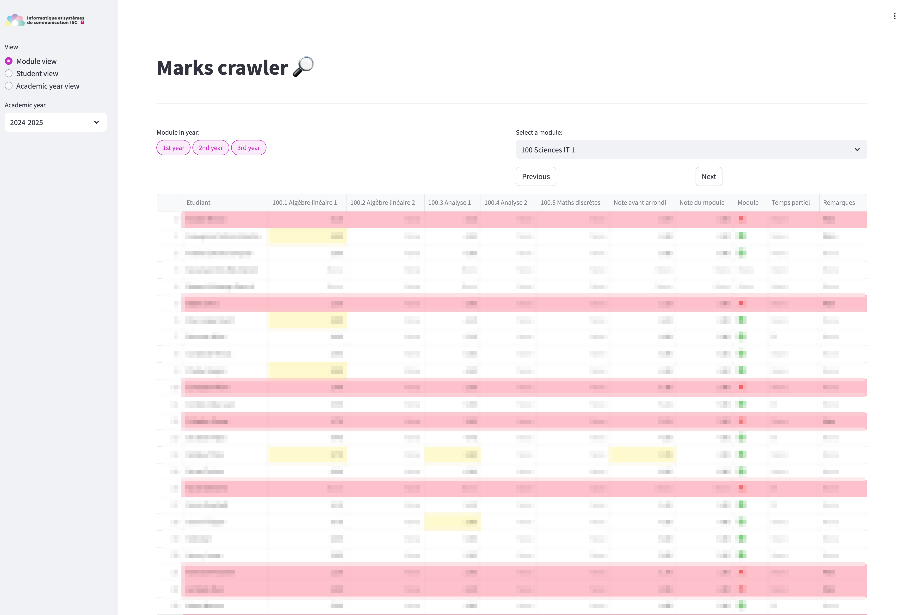

# Marks crawler from XLSX files


This script provides a [Streamlit](https://streamlit.io/) application for visualizing and analyzing student marks.

It allows users to view marks by module, student, or academic year. The application
loads data from Excel files, preprocesses it, and presents it in interactive tables
with features like highlighting failing grades and sorting.
The application consists of the following main functionalities:
- **Data Loading and Preprocessing:**
    - Loads data from Excel files in a specified directory.
    - Removes unnecessary rows and columns.
    - Mangles column names for better readability.
    - Extracts module code, module name, and academic year from filenames.
- **Module View:**
    - Displays a selectbox with module names.
    - Shows the corresponding DataFrame for the selected module.
    - Highlights failing grades in pink.
    - Allows navigation between modules using "Previous" and "Next" buttons.
- **Student View:**
    - Displays a selectbox with student names.
    - Shows the aggregated information for the selected student across all modules.
    - Presents a summary table with module results and final grades.
    - Displays detailed course data for each module.
- **Academic Year View:**
    - Displays a view of student marks aggregated by academic year and module level.
    - Allows filtering by module level (1st year, 2nd year, 3rd year).
    - Highlights failing grades in pink.
The application uses Streamlit for the user interface and pandas for data manipulation.
It also utilizes regular expressions for extracting information from filenames.

## Preview




## Usage

Add the modules marks Excel files in `res/marks` folder. There's even a script to gather all of them (`gather_copy.sh`). Enjoy!

## How to install and run

### Installing with UV
```bash
curl -LsSf https://astral.sh/uv/install.sh | sh
uv python install
uv add streamlit
```

### Running with UV
Then run with `uv run streamlit run marks_overview.py`

### Creating a streamlit app from scratch (NOT required here)
```bash
curl -LsSf https://astral.sh/uv/install.sh | sh
uv python install
uv init hello-world
uv run hello.py
uv add streamlit
uv run streamlit
```

## Deployment
### `docker`
1. Clone and cd into the directory
```
git clone https://github.com/ISC-HEI/Marks-crawler.git && cd Marks-crawler
```
1. Build the `docker` image.
```
./docker_build.sh
```
1. Run it
```
docker run -d --name marks_crawler_dev --restart=unless-stopped -p 8501:8501 isc-hei/marks_crawler
```
1. Test it on http://localhost:8501
### `apache` proxy
Here is a sample file for using `apache` as a proxy for this application.
```properties
<IfModule mod_ssl.c>
	<VirtualHost _default_:443>
		ServerName marks.example.com
		ServerAdmin webmaster@localhost

		Include /etc/XXX/options-ssl-apache.conf

		DocumentRoot /var/www/html
    <Location />
            Require all granted
    </Location>
    ProxyPreserveHost on
    ProxyRequests   on
		RewriteEngine On
		RewriteCond %{HTTP:Upgrade} =websocket
		RewriteRule /(.*) ws://localhost:8501/$1 [P]
		RewriteCond %{HTTP:Upgrade} !=websocket
		RewriteRule /(.*) http://localhost:8501/$1 [P]
		ProxyPassReverse / http://localhost:8501
	</VirtualHost>
</IfModule>
```
